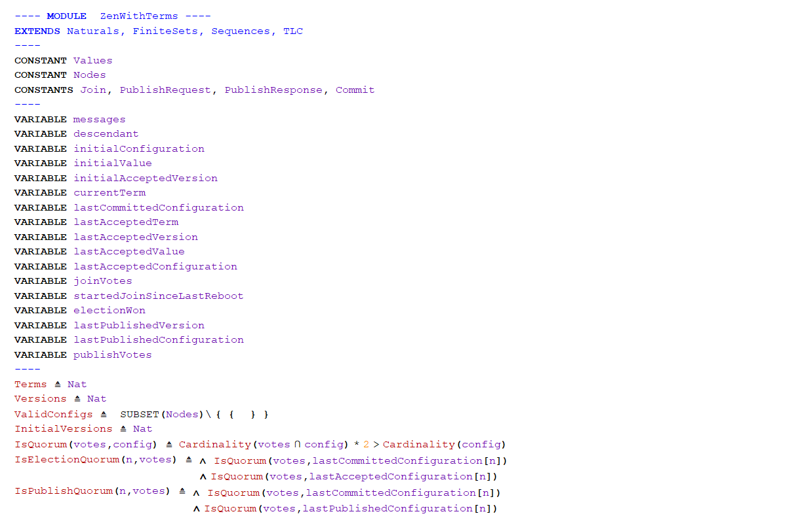
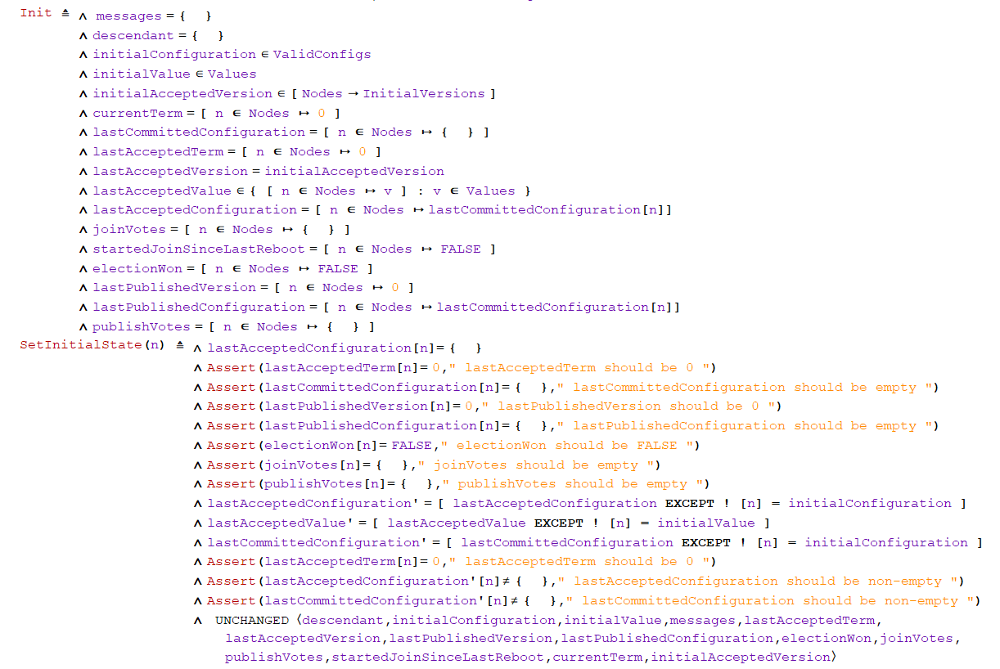
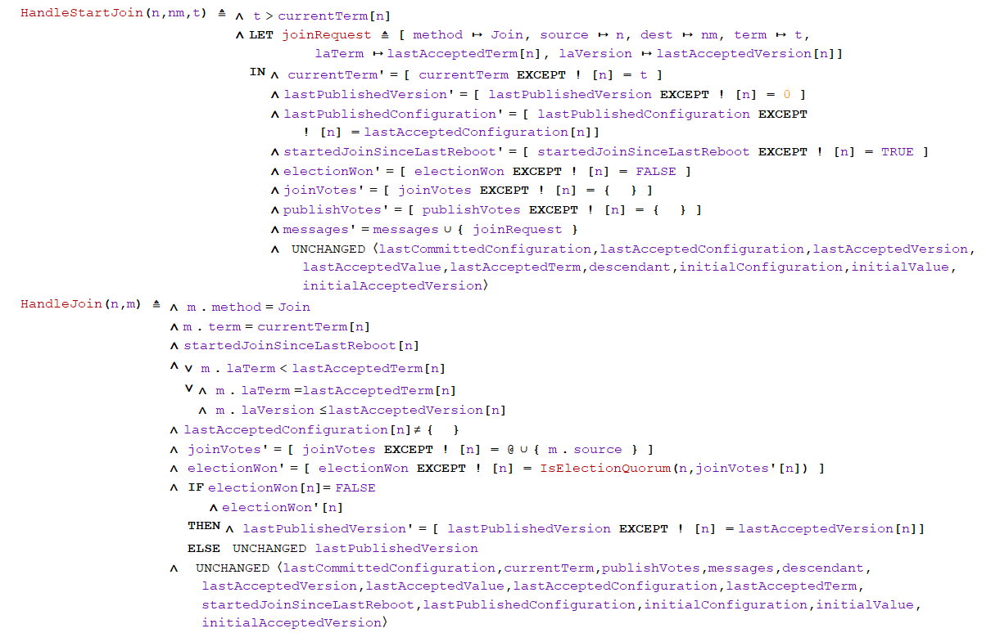
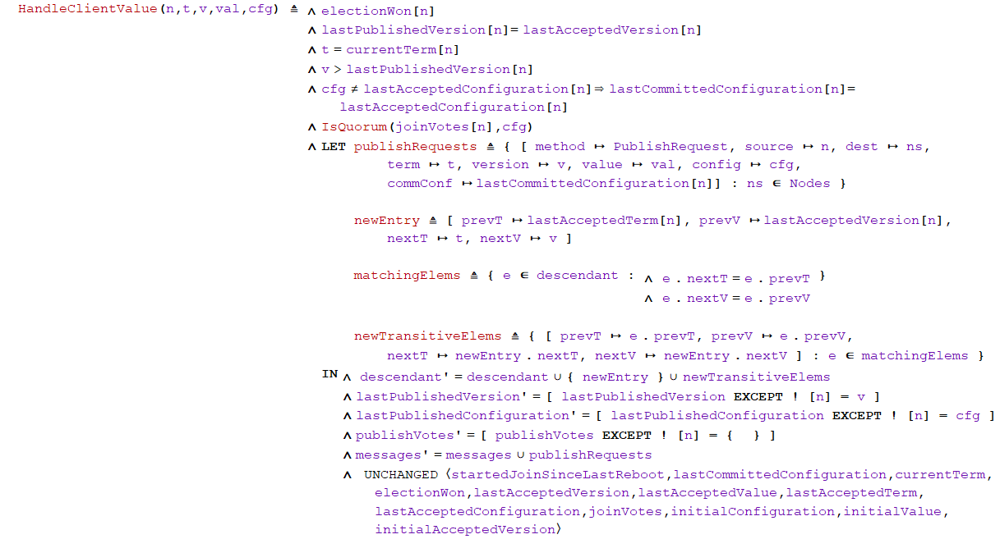
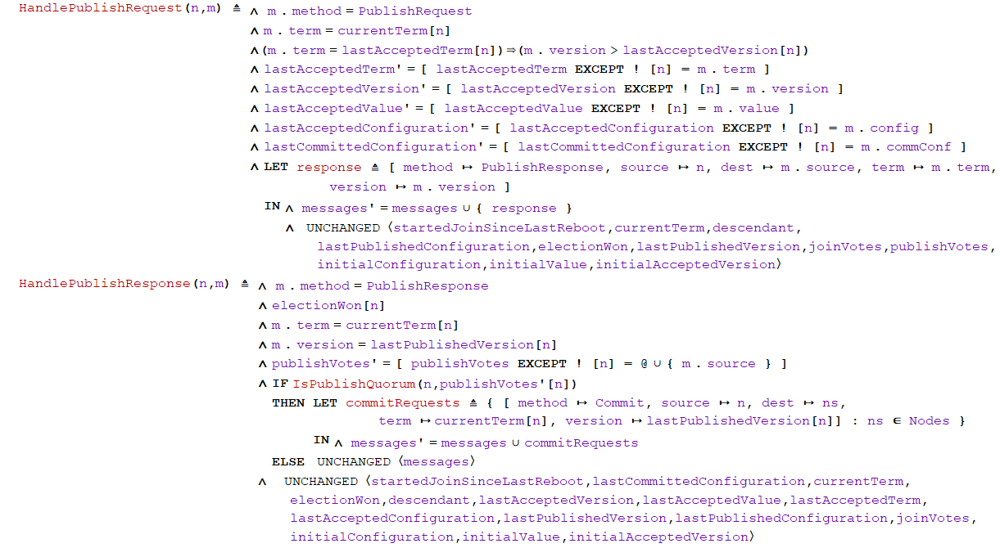
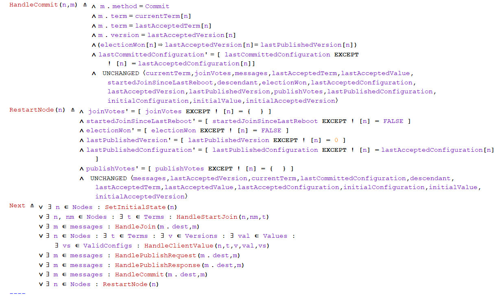
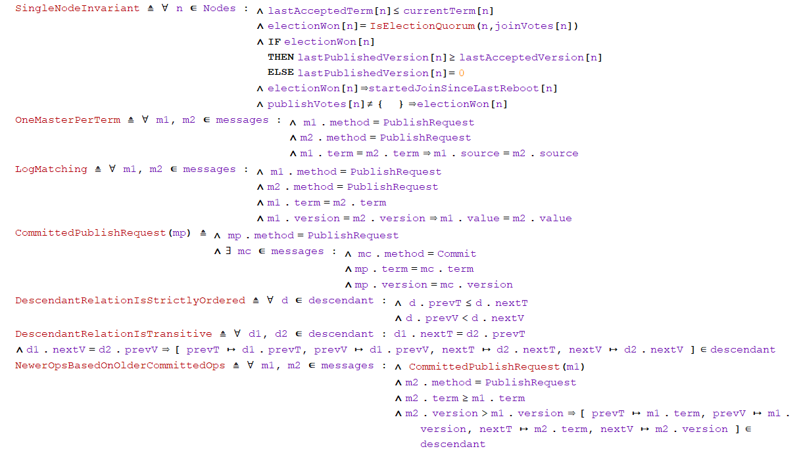
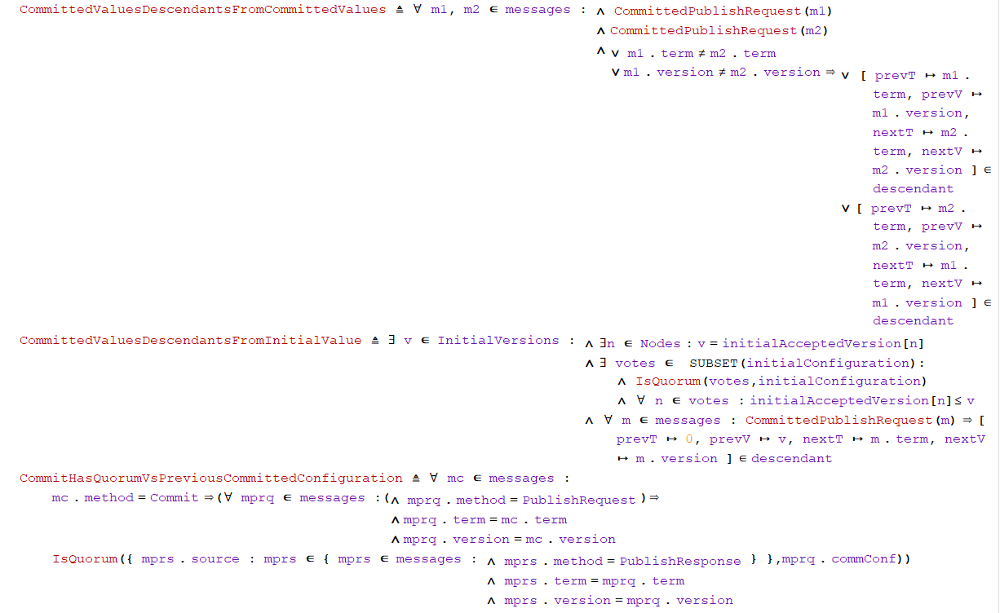
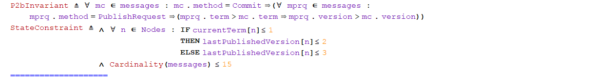

Example
===

Below is a rendering of https://github.com/elastic/elasticsearch-formal-models/blob/master/ZenWithTerms/tla/ZenWithTerms.tla within SpecEdit (with the corresponding LateX rendering from the TLA+ Toolbox [ZenWithTermsLateX.pdf](ScreenshotsOfTheExample/ZenWithTermsLateX.pdf)):

 

 

 

 

 

 

 

 

 

